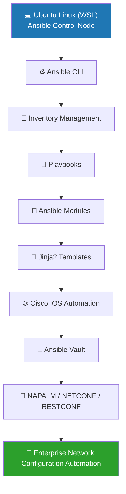

# 🚀 Lab 01 – Ansible Installation & Environment Setup

> **Repository:** Ansible Network Automation
> **Lab:** 01 – Installation & Environment Setup
> **Platform:** Ubuntu WSL (Linux)
> **Automation Framework:** Ansible Core 2.16.3
> **Focus:** Linux Environment Preparation, Ansible CLI, Configuration Validation & Documentation

---

## 📖 Overview

A reliable automation environment is the foundation of every successful network automation workflow. Before managing network devices, developing playbooks, or deploying enterprise configurations, it is essential to establish a stable and well-documented Ansible Control Node.

This lab focuses on installing, validating, and documenting the Ansible automation environment using **Ubuntu WSL (Linux)**. It introduces the essential Ansible command-line utilities required to inspect the installation, examine the default configuration, explore built-in documentation, and verify the overall readiness of the automation platform.

Since **Ansible is designed to run natively on Linux**, this repository intentionally uses **Ubuntu WSL** to simulate a real-world automation environment. Throughout this project, extensive use of Linux command-line tools will complement Ansible automation, reinforcing practical Linux system administration skills alongside enterprise network automation concepts.

The environment prepared in this lab will serve as the **Ansible Control Node** for all subsequent exercises, including inventory management, playbook development, Jinja2 templating, Cisco IOS automation, roles, Ansible Vault, NAPALM, NETCONF, RESTCONF, and the final **Enterprise Network Configuration Automation** project.

---

## 🎯 Objectives

Upon completing this lab, you will be able to:

* Verify a successful Ansible installation on Ubuntu WSL.
* Understand the role of Linux in enterprise network automation.
* Explore the Ansible Command Line Interface (CLI).
* Examine the default Ansible configuration.
* Access and interpret Ansible module documentation.
* Understand the purpose of the Ansible Control Node.
* Organize automation projects using a structured repository layout.
* Document command outputs for future reference and troubleshooting.

---

## 🧠 Concepts Covered

This lab introduces the fundamental concepts required before automating network devices.

| Concept                | Description                                                                               |
| ---------------------- | ----------------------------------------------------------------------------------------- |
| **Ansible Core**       | The automation engine used to configure, manage, and orchestrate IT infrastructure.       |
| **Control Node**       | The Linux system where Ansible is installed and from which automation tasks are executed. |
| **Managed Nodes**      | Remote systems or network devices managed by the Ansible Control Node.                    |
| **SSH Authentication** | The secure communication method used by Ansible to connect to managed devices.            |
| **Inventory**          | A file containing information about managed hosts and device groups.                      |
| **Ansible Modules**    | Reusable units of work that perform specific automation tasks.                            |
| **YAML**               | A human-readable language used to write Ansible inventories and playbooks.                |
| **Linux Command Line** | The primary environment used to execute Ansible commands and manage automation projects.  |

---

## 🏗️ Ansible Architecture

Ansible follows an **agentless architecture**, meaning no software agents need to be installed on the managed devices. The **Control Node** communicates securely with remote systems using **SSH**, executes automation tasks, and collects the results.



### Architecture Components

| Component                | Description                                                                       |
| ------------------------ | --------------------------------------------------------------------------------- |
| **Ubuntu WSL**           | Hosts the Ansible Control Node and provides the Linux environment for automation. |
| **Ansible Control Node** | Executes playbooks, modules, and automation tasks.                                |
| **Inventory**            | Defines the managed hosts and host groups.                                        |
| **Playbooks**            | YAML files that describe automation workflows.                                    |
| **Modules**              | Reusable units that perform individual automation tasks.                          |
| **Jinja2 Templates**     | Generate dynamic configurations using variables.                                  |
| **Cisco IOS Devices**    | Managed network devices that receive configuration changes over SSH.              |

> **Note:** In this lab, only the Ansible Control Node is configured and validated. Cisco IOS devices will be introduced in later labs when we begin network device automation.
---

## 🐧 Linux Commands Used

Throughout this repository, Ubuntu Linux (WSL) serves as the primary operating environment for developing and executing Ansible automation tasks. The following Linux commands were used during this lab.

| Command | Purpose                                                            |
| ------- | ------------------------------------------------------------------ |
| `pwd`   | Displays the current working directory.                            |
| `cd`    | Changes the current working directory.                             |
| `mkdir` | Creates new directories for organizing the project.                |
| `touch` | Creates new files such as `README.md` and notes.                   |
| `ls`    | Lists files and directories.                                       |
| `tree`  | Displays the project directory structure in a hierarchical format. |
| `which` | Locates the installed Ansible executable.                          |
| `>`     | Redirects command output into documentation files.                 |

> **Note:** Linux command-line usage is an integral part of enterprise automation workflows. Throughout this repository, Linux utilities are used alongside Ansible to manage files, organize projects, capture outputs, and execute automation tasks efficiently.
---

## ⚙️ Ansible Commands Executed

The following commands were executed to validate the Ansible installation, inspect its configuration, and explore the available documentation.

| Command                            | Purpose                                                                                    | Output File                                     |
| ---------------------------------- | ------------------------------------------------------------------------------------------ | ----------------------------------------------- |
| `ansible --version`                | Displays the installed Ansible version along with Python, Jinja2, and LibYAML information. | `commands/ansible_version.txt`                  |
| `which ansible`                    | Locates the Ansible executable on the system.                                              | `commands/which_ansible.txt`                    |
| `ansible-config dump`              | Displays the complete active Ansible configuration.                                        | `commands/ansible_config_dump.txt`              |
| `ansible-doc ping`                 | Displays documentation for the built-in Ping module.                                       | `commands/ansible_doc_ping.txt`                 |
| `ansible-doc ansible.builtin.ping` | Displays the fully qualified documentation for the Ping module.                            | `commands/ansible_doc_ansible_builtin_ping.txt` |
| `ansible-doc -l \| grep ios`       | Lists available Cisco IOS-related Ansible modules (if installed).                          | `commands/ansible_modules.txt`                  |

> **Note:** Instead of manually copying terminal output into the documentation, command output was redirected to text files using Linux output redirection (`>`). This approach improves reproducibility, keeps the repository organized, and preserves execution results for future reference.
---

## 📄 Command Outputs & Observations

The executed commands confirmed that the Ansible environment was successfully installed and configured on Ubuntu Linux (WSL). The generated outputs provide valuable information about the automation environment and serve as a reference for future labs.

| Verification             | Observation                                                                                                         |
| ------------------------ | ------------------------------------------------------------------------------------------------------------------- |
| **Ansible Version**      | Confirmed the installed version of Ansible Core along with Python, Jinja2, and LibYAML support.                     |
| **Executable Path**      | Verified that the Ansible executable is available in the system PATH and can be invoked directly from the terminal. |
| **Configuration**        | Displayed the active Ansible configuration and confirmed that the default configuration was being used.             |
| **Module Documentation** | Successfully accessed the documentation for the built-in `ping` module.                                             |
| **Available Modules**    | Explored installed Ansible modules and verified the availability of module documentation through the Ansible CLI.   |

### Generated Output Files

```text
commands/
├── ansible_version.txt
├── which_ansible.txt
├── ansible_config_dump.txt
├── ansible_doc_ping.txt
├── ansible_doc_ansible_builtin_ping.txt
└── ansible_modules.txt
```

> **Observation:** Storing command outputs as separate files keeps the documentation concise while preserving complete execution details for verification, troubleshooting, and future reference.

---

---

## 📸 Screenshots

The following screenshots document the successful completion of the tasks performed during this lab.

| Screenshot                | Description                                                                                                        |
| ------------------------- | ------------------------------------------------------------------------------------------------------------------ |
| `vscode_workspace.png`    | VS Code workspace connected to Ubuntu WSL, showing the project structure, integrated terminal, and README preview. |
| `ansible_version.png`     | Verification of the installed Ansible Core version.                                                                |
| `which_ansible.png`       | Location of the Ansible executable.                                                                                |
| `ansible_config_dump.png` | Active Ansible configuration.                                                                                      |
| `ansible_doc_ping.png`    | Documentation of the built-in Ping module.                                                                         |
| `ansible_modules.png`     | Available Ansible modules.                                                                                         |
| `project_structure.png`   | Directory structure of the Lab 01 project.                                                                         |

> **Note:** All screenshots are stored in the `lab01_installation/screenshots/` directory. Shared images, repository banners, and architecture diagrams are maintained under the root `assets/` directory.

---

## 🔍 Observations

During the execution of this lab, the following observations were made:

* Ansible Core was successfully installed and executed from the Ubuntu Linux (WSL) environment.
* No custom `ansible.cfg` file was detected; therefore, Ansible operated using its default configuration.
* The `ansible-doc` utility provides comprehensive built-in documentation, making it an essential resource for understanding modules and their usage.
* Command output redirection (`>`) proved to be an effective way to preserve execution results for documentation and future reference.
* Organizing commands, notes, and screenshots into separate directories improves maintainability and keeps the repository well structured.
* Ubuntu Linux (WSL) provides a practical environment for learning Ansible while simultaneously strengthening Linux command-line skills.

> **Engineering Note:** Well-organized documentation and reproducible command outputs are as important as successful command execution. A structured repository simplifies troubleshooting, collaboration, and future maintenance.

---

## 🛠️ Troubleshooting

The following table lists common issues that may be encountered while setting up or verifying an Ansible environment on Ubuntu Linux (WSL), along with their possible causes and solutions.

| Issue                                           | Possible Cause                                                | Resolution                                                                               |
| ----------------------------------------------- | ------------------------------------------------------------- | ---------------------------------------------------------------------------------------- |
| `ansible: command not found`                    | Ansible is not installed or not available in the system PATH. | Install Ansible and verify the executable using `which ansible`.                         |
| `Permission denied`                             | Insufficient file or directory permissions.                   | Verify permissions and use appropriate ownership or privilege escalation where required. |
| `ansible-doc` not displaying module information | Incorrect module name or missing collection.                  | Verify the module name and ensure the required collection is installed.                  |
| Configuration values not as expected            | Custom configuration file overriding defaults.                | Run `ansible-config dump` to inspect the active configuration.                           |
| Output files not generated                      | Incorrect output redirection or invalid file path.            | Verify the destination directory before redirecting output using `>`.                    |

> **Note:** No major installation or configuration issues were encountered during this lab. All verification commands executed successfully in the Ubuntu Linux (WSL) environment.

---

## 🎓 Key Takeaways

Upon completing this lab, the following skills and concepts were successfully acquired:

* Verified a complete Ansible Core installation on Ubuntu Linux (WSL).
* Understood the role of the **Ansible Control Node** in network automation.
* Explored essential Ansible CLI utilities for installation verification and documentation.
* Examined the active Ansible configuration using built-in tools.
* Learned how to access module documentation directly from the command line.
* Applied Linux command-line operations for project organization and documentation.
* Preserved command outputs using Linux output redirection for reproducibility.
* Established a structured repository foundation for the remaining automation labs.

This lab provides the foundation for all subsequent topics in the repository, including inventories, playbooks, Jinja2 templating, Cisco IOS automation, roles, Vault, NAPALM, NETCONF, RESTCONF, and enterprise-scale network automation.

---

## 📚 References

The following resources were consulted during this lab:

* Official Ansible Documentation
* Ansible CLI Documentation
* Ubuntu Linux Documentation
* Python Documentation
* Jinja2 Documentation
* YAML Specification

> The official documentation remains the primary reference for understanding Ansible architecture, modules, playbooks, inventories, and automation best practices.


---

## ➡️ Next Lab

In **Lab 02 – Inventory Files**, the focus shifts from preparing the automation environment to defining the infrastructure that Ansible will manage.

Topics covered in the next lab include:

* Static inventory using INI format
* YAML-based inventory
* Host groups and child groups
* Host variables
* Group variables
* Inventory aliases
* Inventory validation and organization

The inventory created in Lab 02 will become the foundation for executing ad-hoc commands and Ansible playbooks in the subsequent labs.
